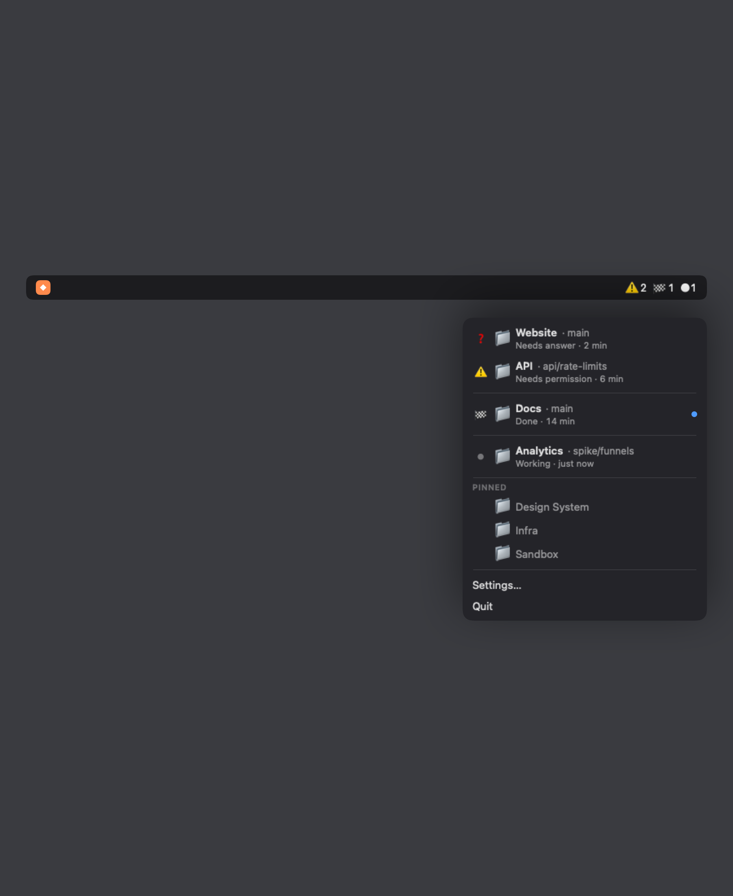

[English](README.md) · [Русский](README.ru.md)

# Aikon

Aikon shows the status of AI coding sessions inside your editor. Right now it
works with Claude Code and the VS Code family of editors.



Every folder with a session is in the menu, with its state and the time since
the last activity. Click a line and that folder's editor window comes to the
front.

## Install

1. Download the zip from [Releases](../../releases), unzip it, drag **Aikon**
   into Applications.
2. The app is signed, but not notarized by Apple, so macOS asks about it once.
   One line in Terminal, on any version of macOS:

   ```sh
   xattr -cr /Applications/Aikon.app
   ```

   Without the Terminal: on macOS 14, right-click Aikon, choose *Open*, then
   *Open* again. On macOS 15 and newer, double-click it, dismiss the warning, then
   go to *System Settings → Privacy & Security* and click *Open Anyway*.
3. Launch Aikon. It has no Dock icon, look for it in the menu bar.
4. Open **Settings → Status hook → Install**.

Step 4 is what makes the difference between *"Claude is busy"* and *"Claude asked
you something and stopped"*. The hook registers a handful of entries in
`~/.claude/settings.json`, backs the file up first, and leaves your other hooks
alone. Remove it from the same screen.

## What it reads

Session transcripts from the folder set in Settings (`~/.claude/projects` by
default) and the list of folders your editor has open. Both already sit on your
disk. Only the working folder and the reason a session stopped are read out of a
transcript, never the conversation itself.

Aikon makes one network request: to GitHub, at most once every three days, to check for a
newer release. Turn it off in Settings and it's gone entirely. Nothing else
goes out — no analytics, no project names, no session text.

## Requirements

macOS 14 or newer, on Apple Silicon or Intel. Claude Code. An editor from the
VS Code family: VS Code, Cursor, Windsurf or VSCodium. Every one of them ships a
description of itself that Aikon reads, so it picks up whichever you have
installed.

Zed and the JetBrains IDEs keep their open windows somewhere else and need their
own bit of code. There is an open issue if you want to help.

## Usage limits

The menu can also show how much of your five-hour and weekly Claude limits you
have spent. Aikon doesn't measure that itself. It reads
`~/.claude/tools/notify/state/limits` if something else on your machine writes
that file: one line, `used5h used7d writtenAt reset5h reset7d`, shares as
fractions and reset times as unix seconds. No file, no block in the menu.

## Build from source

```sh
bash scripts/install.sh
```

That builds a universal app, signs it and puts it in `/Applications`. Needs
Swift 6, which comes with Xcode 16 or newer. No dependencies, about 2 MB built.

If you hand this repository to a coding agent, `CLAUDE.md` at the root has the
commands and the house rules.

## Author

**Anna Dorogova**

[GitHub](https://github.com/blinbirka) ·
[adorogova.com](https://adorogova.com) ·
[LinkedIn](https://www.linkedin.com/in/annadorogova/) ·
[dorogova.ann@gmail.com](mailto:dorogova.ann@gmail.com)

MIT licence.
